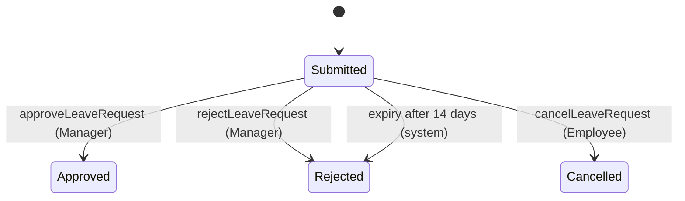
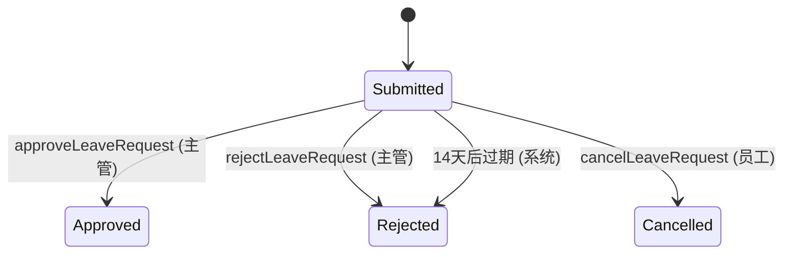

# DOMAIN

# English Version

```Markdown
<!-- DOMAIN — the vocabulary + cross-cutting rules in this area.
     Edit this worked example in place (here the area has a single slug,
     leave-requests), then strip the guidance comments. -->

# Domain — leave-requests

Shared vocabulary + area-wide rules that this area's slugs (here: leave-requests) reference.
<!-- ^ one line: the shared vocabulary + cross-cutting rules every slug references -->

## Entities
<!-- Only fields the user / business cares about — not a DB schema. Use exact names that
     api-spec.yaml schemas and api-logic.md reuse verbatim. -->
| Entity | Fields the user / business cares about |
| --- | --- |
| `LeaveRequest` | `employeeId`, `type`, `startDate`, `endDate`, `reason`, `status`, `decidedBy`, `decidedAt`, `createdAt` |
| `Employee` | `managerId`, `leaveBalanceDays` |

## Relationships
<!-- Omit this section if all relationships are trivial. One line per non-obvious link. -->
- `Employee` 1—* `LeaveRequest` (an employee files many requests)
- `Employee` 1—* `Employee` (a manager has many direct reports, via `managerId`)

## Enums
- `LeaveType = Annual | Sick | Unpaid`
- `LeaveStatus = Submitted | Approved | Rejected | Cancelled`

## Roles
### Employee
- Scope: per-org
- Granted: default for any employee
- Capability summary: create, view, and cancel their own leave requests
<!-- per-operation authorization lives in api-logic.md, not here -->

### Manager
- Scope: per-team (their direct reports)
- Granted: assigned by HR
- Capability summary: view and approve / reject their direct reports' requests
- Invariant: cannot decide their own request

## Lifecycles
<!-- Only for fields with a non-trivial state machine. Omit the section if the feature has none.
     Label each transition with the operationId (or job) that drives it. -->
### `LeaveRequest.status`


## Invariants
<!-- Always-true, testable properties that hold across operations. Distinct from api-logic.md
     per-operation rules and from scenarios' concrete examples. -->
- `endDate` is on or after `startDate`.
- For `Annual` leave, a request's `workingDays` cannot exceed the employee's
  `leaveBalanceDays` at the time it is submitted.
- A Manager cannot approve or reject their own request.
- `decidedBy` and `decidedAt` are set if and only if `status` is `Approved` or `Rejected`.

## Cross-cutting rules
<!-- Rules that hold for EVERY operation across the AREA. Omit the
     section if the area has none. -->
- **Audited writes** — every state-changing operation records an audit entry: who, what, when.
- **UTC times** — all timestamps are stored and returned in UTC.
```

# 中文版本

```Markdown
<!-- 领域模型 (DOMAIN) — 该领域内的词汇表 + 横切规则。
     请就地编辑此工作示例，然后删除这些指导性注释。 -->

# 领域模型 (Domain) — leave-requests

本领域内特性标识符（此处为：leave-requests）所引用的共享词汇表 + 领域级规则。
<!-- ^ 用一句话描述：每个特性标识符都会引用的共享词汇表 + 横切规则 -->

## 实体 (Entities)
<!-- 仅包含用户/业务关心的字段 — 而非数据库表结构。请使用 api-spec.yaml 模式和 api-api-logic.md 中原样复用的确切名称。 -->
| 实体 | 用户/业务关心的字段 |
| --- | --- |
| `LeaveRequest` | `employeeId`, `type`, `startDate`, `endDate`, `reason`, `status`, `decidedBy`, `decidedAt`, `createdAt` |
| `Employee` | `managerId`, `leaveBalanceDays` |

## 关系 (Relationships)
<!-- 如果所有关系都很简单，请省略此部分。每个非显而易见的关联占一行。 -->
- `Employee` 1—* `LeaveRequest`（一名员工可提交多份申请）
- `Employee` 1—* `Employee`（一名主管有多名直属下属，通过 `managerId` 关联）

## 枚举 (Enums)
- `LeaveType` = `Annual` (年假) | `Sick` (病假) | `Unpaid` (无薪假)
- `LeaveStatus` = `Submitted` (已提交) | `Approved` (已批准) | `Rejected` (已拒绝) | `Cancelled` (已取消)

## 角色 (Roles)
### 员工 (Employee)
- 作用域 (Scope)：按组织 (per-org)
- 授予方式 (Granted)：任何员工的默认权限
- 能力摘要 (Capability summary)：创建、查看和取消自己的休假申请
<!-- 每个操作的具体授权规则位于 api-logic.md 中，而非此处 -->

### 主管 (Manager)
- 作用域 (Scope)：按团队 (其直属下属)
- 授予方式 (Granted)：由人力资源 (HR) 分配
- 能力摘要 (Capability summary)：查看并批准/拒绝其直属下属的申请
- 不变量 (Invariant)：无法审批自己的申请

## 生命周期 (Lifecycles)
<!-- 仅针对具有非平凡状态机的字段。如果该特性没有，请省略此部分。使用驱动该转换的 operationId（或任务）来标记每个转换。 -->
### `LeaveRequest.status`


## 业务不变量 (Invariants)
<!-- 跨操作始终成立且可测试的属性。区别于 api-api-logic.md 中的单操作规则和 scenarios 中的具体示例。 -->
- `endDate` (结束日期) 必须在 `startDate` (开始日期) 当天或之后。
- 对于 `Annual` (年假)，申请时的 `workingDays` (工作日天数) 不能超过员工当时的 `leaveBalanceDays` (休假余额天数)。
- 主管不能批准或拒绝自己的申请。
- 当且仅当 `status` 为 `Approved` 或 `Rejected` 时，`decidedBy` 和 `decidedAt` 才会被设置。

## 横切规则 (Cross-cutting rules)
<!-- 适用于该领域内所有 (EVERY) 操作的规则，如果该领域没有此类规则，请省略此部分。 -->
- **操作审计 (Audited writes)** — 每次状态变更操作都会记录一条审计日志：操作人、操作内容、操作时间。
- **UTC 时间 (UTC times)** — 所有时间戳均以 UTC 格式存储和返回。
```

