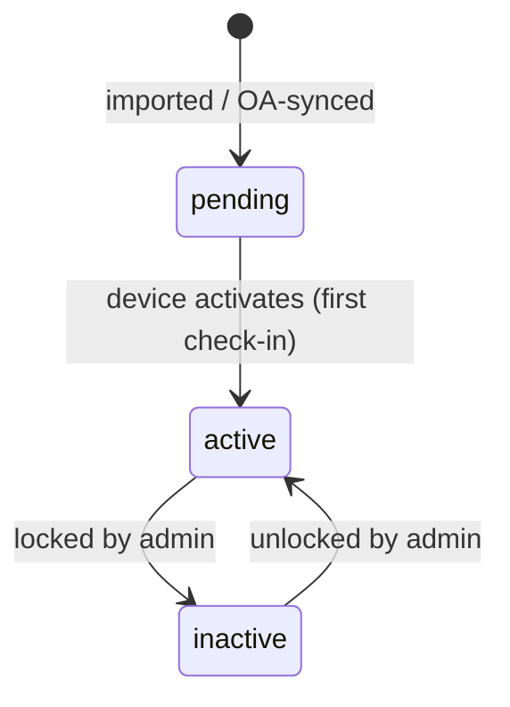

# Domain — devices

Shared vocabulary + area-wide rules for the device fleet that the devices slug references.

## Entities
| Entity | Fields the user / business cares about |
| --- | --- |
| `Device` | `sn`, `certCn`, `partnerId`, `modelCode`, `devicePn`, `osVersion`, `firmwareVersion`, `buildNumber`, `hardwareCode`, `runMode`, `status`, `developMode`, `rootMode`, `pciVersion`, `creationType`, `creationUserId`, `activatedAt`, `lastSeenAt`, `createdAt`, `network`, `battery`, `storage`, `settings`, `hardware` |
| `DeviceStoreRelationship` | `deviceSn`, `storeId`, `storeName`, `merchantName`, `status`, `createdAt` |
| `DeviceApplication` | `deviceSn`, `pkgName`, `appName`, `versionName`, `versionCode`, `installedAt`, `isUninstallable`, `isAutoStartOnBoot`, `isKioskMode`, `isAppLaunchDisabled`, `isLauncherIconHidden` |
| `PushHistoryItem` | `kind`, `target`, `queuedAt`, `status`, `completedAt`, `by`, `error` |
| `PrewarningEvent` | `kind`, `policy`, `at`, `level`, `detail` |

## Relationships
- `Merchant` 1—* `Store`; `Store` *—* `Device` (a device may belong to several stores, via `DeviceStoreRelationship`)
- `DeviceModel` 1—* `Device` (a device is one instance of a model, via `modelCode`)
- `Device` 1—* `DeviceApplication` (the apps reported by the terminal)
- `Device` 1—* `PushHistoryItem` (firmware / app operations sent to the device)
- `Device` 1—* `PrewarningEvent` (alerts the device has triggered)

## Enums
- `DeviceStatus = active (正常) | pending (待激活) | inactive (锁定 / 未激活)`
- `RunMode = UNATTENDED | ATTENDED`
- `PciVersion = PCI6 | PCI7`
- `CreationType = IMPORT | OA_SYNC`
- `NetworkType = wifi | ethernet | cellular | offline`
- `SecurityFlag = rooted | devMode | warnings`
- `PushKind = firmware | app-install | app-update | app-uninstall`
- `PushStatus = pending | completed | failed`
- `PrewarningKind = traffic | geofence | disk`
- `PrewarningLevel = critical | warning | info`

## Roles
### Admin
- Scope: limited to the merchants / stores the user is permitted to see (see [Visible scope])
- Granted: assigned to platform / merchant administrators
- Capability summary: list, summarize, export and view devices; push firmware and apps;
  view monitoring and trigger re-collection; view and configure pre-warning policies

## Lifecycles
### `Device.status`

## Invariants
- `sn` is unique across the whole fleet.
- `certCn` is the payment certificate CN reported by the terminal; it identifies the device's
  true owner.
- A device may belong to more than one store at the same time.
- A device is flagged with a hardware-integrity alert whenever it is `rooted`, has developer
  mode on, or carries any security warning.
- Monitoring telemetry is marked stale when its collection time is older than the freshness
  threshold.
- A caller only ever sees devices inside their permitted merchant / store scope.

## Cross-cutting rules
- **Visible scope** — every read and write is restricted to the caller's permitted merchant /
  store scope; a device outside scope is treated as not found.
- **Audited writes** — every push / configuration change records an audit entry: who, what, when.
- **UTC times** — all timestamps are stored and returned in UTC.

## Open questions (待确认)
- `HARDWARE ID` overlaps conceptually with `OS VERSION` — keep only one?
- `CLIENT CERTIFICATE` has no usage scenario in the prototype — is it needed?
- `TRANSFER KEY` may belong to the device-key data model rather than `Device`.
- A device can belong to multiple stores, but the merchant detail "Deployment" card can't
  express this; is the card's address the store's or the merchant's?
- In App & Firmware, what exactly do Required / Installed / Missing / Outdated mean?
