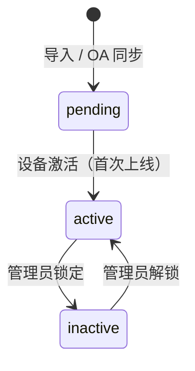

# 领域模型 (Domain) — devices

设备机群的共享词汇表 + 领域级规则，由 devices 特性标识符引用。

## 实体 (Entities)
| 实体 | 用户/业务关心的字段 |
| --- | --- |
| `Device` | `sn`, `certCn`, `partnerId`, `modelCode`, `devicePn`, `osVersion`, `firmwareVersion`, `buildNumber`, `hardwareCode`, `runMode`, `status`, `developMode`, `rootMode`, `pciVersion`, `creationType`, `creationUserId`, `activatedAt`, `lastSeenAt`, `createdAt`, `network`, `battery`, `storage`, `settings`, `hardware` |
| `DeviceStoreRelationship` | `deviceSn`, `storeId`, `storeName`, `merchantName`, `status`, `createdAt` |
| `DeviceApplication` | `deviceSn`, `pkgName`, `appName`, `versionName`, `versionCode`, `installedAt`, `isUninstallable`, `isAutoStartOnBoot`, `isKioskMode`, `isAppLaunchDisabled`, `isLauncherIconHidden` |
| `PushHistoryItem` | `kind`, `target`, `queuedAt`, `status`, `completedAt`, `by`, `error` |
| `PrewarningEvent` | `kind`, `policy`, `at`, `level`, `detail` |

## 关系 (Relationships)
- `Merchant` 1—* `Store`；`Store` *—* `Device`（一台设备可同时归属于多个门店，通过 `DeviceStoreRelationship`）
- `DeviceModel` 1—* `Device`（一台设备是某型号的一个实例，通过 `modelCode`）
- `Device` 1—* `DeviceApplication`（终端上送的应用信息）
- `Device` 1—* `PushHistoryItem`（下发到设备的固件/应用操作）
- `Device` 1—* `PrewarningEvent`（设备已触发的预警）

## 枚举 (Enums)
- `DeviceStatus` = `active` (正常) | `pending` (待激活) | `inactive` (锁定 / 未激活)
- `RunMode` = `UNATTENDED` (无人值守) | `ATTENDED` (有人值守)
- `PciVersion` = `PCI6` | `PCI7`
- `CreationType` = `IMPORT` (导入) | `OA_SYNC` (OA 同步)
- `NetworkType` = `wifi` | `ethernet` (以太网) | `cellular` (蜂窝) | `offline` (离线)
- `SecurityFlag` = `rooted` (已 Root) | `devMode` (开发者模式) | `warnings` (存在告警)
- `PushKind` = `firmware` (固件) | `app-install` (安装应用) | `app-update` (更新应用) | `app-uninstall` (卸载应用)
- `PushStatus` = `pending` (排队中) | `completed` (已完成) | `failed` (失败)
- `PrewarningKind` = `traffic` (流量) | `geofence` (地理围栏) | `disk` (磁盘空间)
- `PrewarningLevel` = `critical` (严重) | `warning` (警告) | `info` (提示)

## 角色 (Roles)
### 管理员 (Admin)
- 作用域 (Scope)：限定于用户有权查看的商户/门店范围（见 [可见范围 (Visible scope)]）
- 授予方式 (Granted)：分配给平台/商户管理员
- 能力摘要 (Capability summary)：查询、汇总、导出和查看设备；推送固件与应用；
  查看监控并触发重新采集；查看和配置预警策略

## 生命周期 (Lifecycles)
### `Device.status`

## 业务不变量 (Invariants)
- `sn`（序列号）在整个机群内唯一。
- `certCn` 是终端上送的支付证书 CN，用于识别设备的真实归属。
- 一台设备可同时归属于多个门店。
- 当设备已 `rooted`（Root）、开启开发者模式或存在任何安全告警时，标记硬件完整性告警。
- 当监控遥测的采集时间超过新鲜度阈值时，标记数据过期。
- 调用者只能看到其有权访问的商户/门店范围内的设备。

## 横切规则 (Cross-cutting rules)
- **可见范围 (Visible scope)** — 每一次读写都限定在调用者有权访问的商户/门店范围内；超出范围的设备视为不存在。
- **操作审计 (Audited writes)** — 每次推送/配置变更都会记录一条审计日志：操作人、操作内容、操作时间。
- **UTC 时间 (UTC times)** — 所有时间戳均以 UTC 格式存储和返回。

## 待确认 (Open questions)
- `HARDWARE ID` 与 `OS VERSION` 概念上有重叠 — 是否二者取其一即可？
- `CLIENT CERTIFICATE` 在原型中没有相应使用场景 — 是否需要该字段？
- `TRANSFER KEY` 是否应放到「设备密钥」数据模型，而非 `Device`？
- 一台设备可归属于多个门店，但商户详情的 Deployment 卡片无法体现这一点；该卡片的地址是门店地址还是商户地址？
- App & Firmware 中的 Required / Installed / Missing / Outdated 分别代表什么含义？
